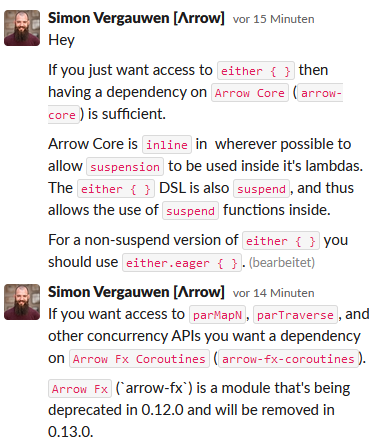

## verify com.winc.archunit.HexagonalArchitecture from buckpal

## onion: how to integrate configuration package ?

## Arrow dependencies... try also arrow-fx-coroutines

## ProductController: AuditorAware with Spring Security

## find non-blocking reactive exception handling for `txo.executeAndAwait(block)`

## "error json-response only via ExceptionHandler ?"

## flyway DB setup

## domain @Aggregate with Command -> State -> (State, [Event])

## checkWidgetCodeUseCase() ...replace or improve

## better kalidation alignment with Validated

## sealed interfaces with Kotlin 1.5
https://blog.jetbrains.com/kotlin/2021/02/new-language-features-preview-in-kotlin-1-4-30/#sealed-interfaces

## try / migrate to value classes
https://blog.jetbrains.com/kotlin/2021/02/new-language-features-preview-in-kotlin-1-4-30/#inline-value-classes-stabilization

## some value in @Pure ?

## more ArchUnit Kotlin extensions

## gradle based build
https://blog.jetbrains.com/kotlin/2021/02/kotlin-1-4-30-released/#cache-support

## domain authorisation AOP-injected into the domain implementation ?
